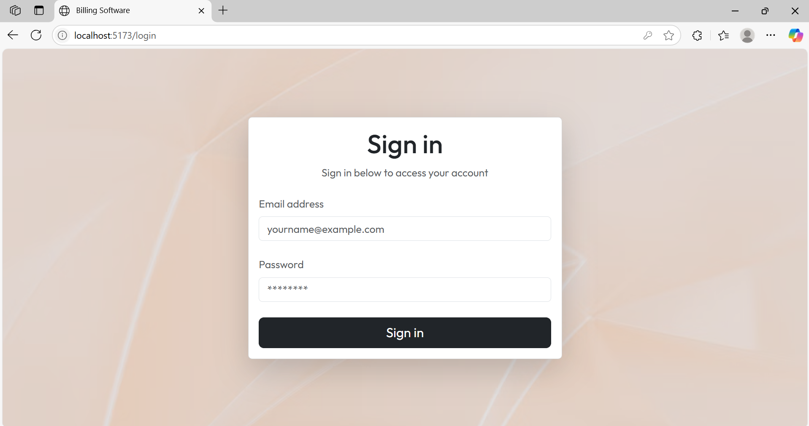
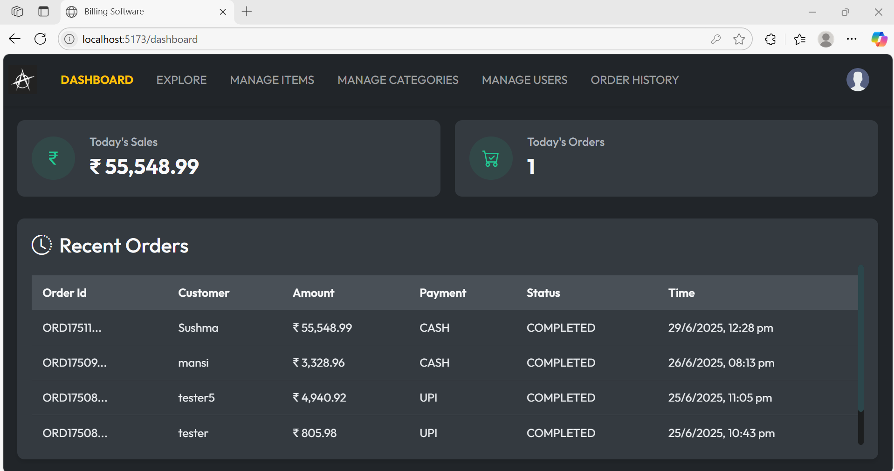
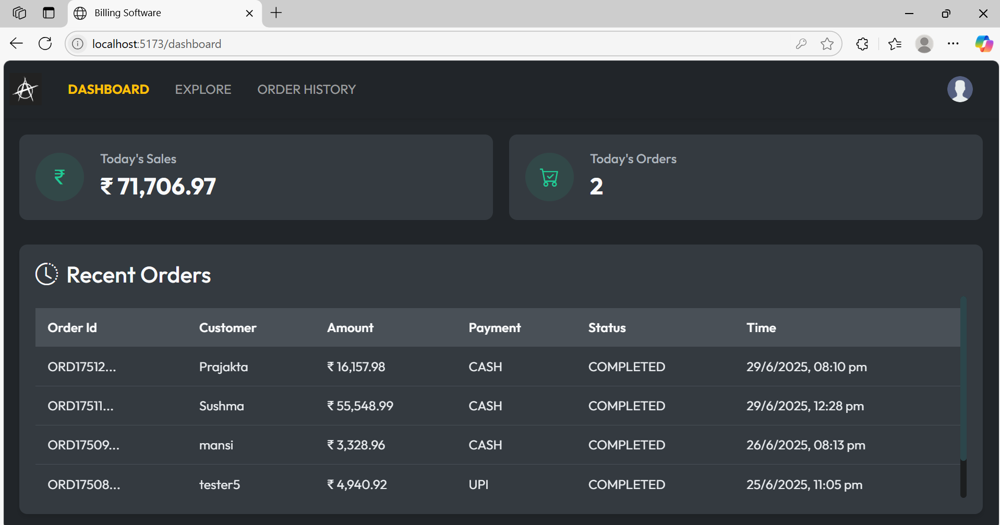
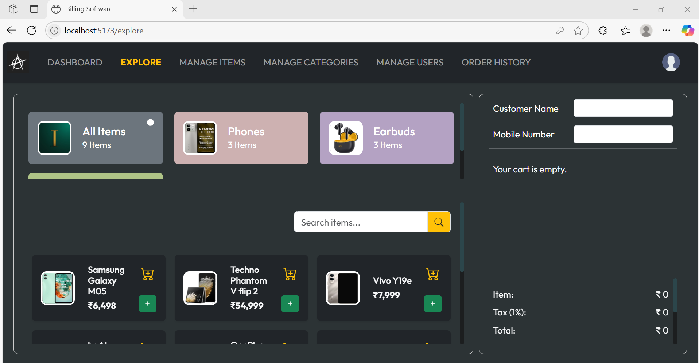
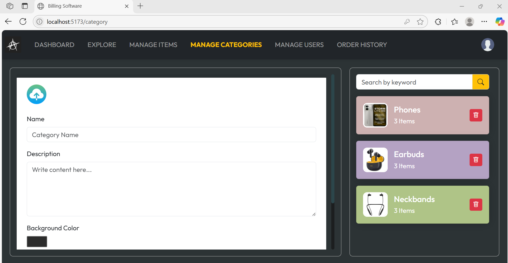
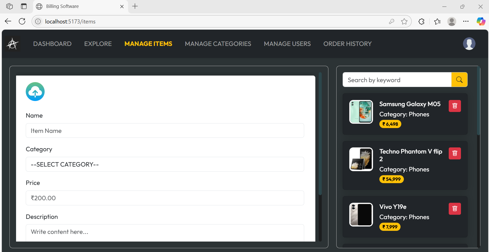
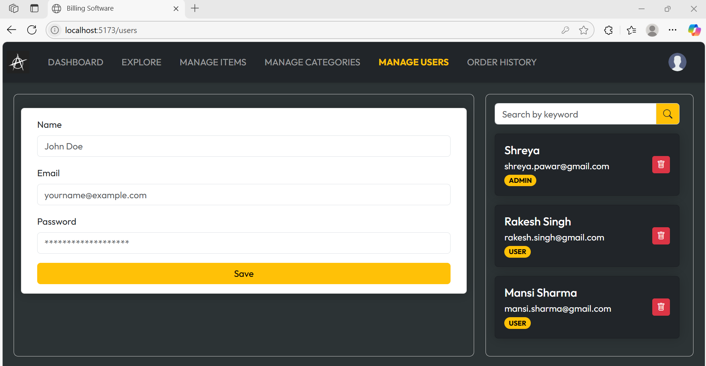
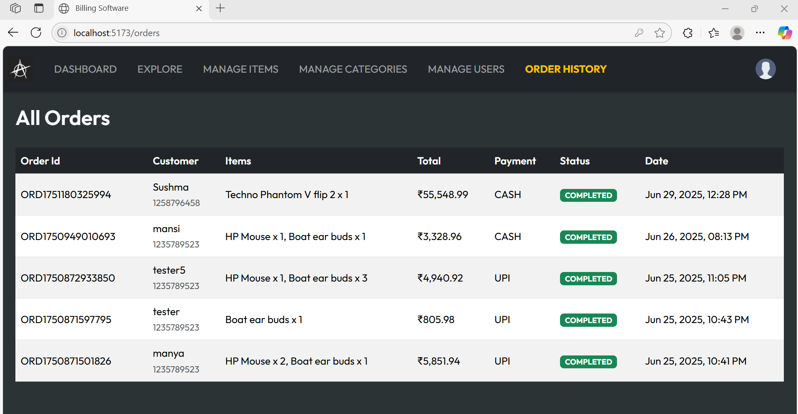
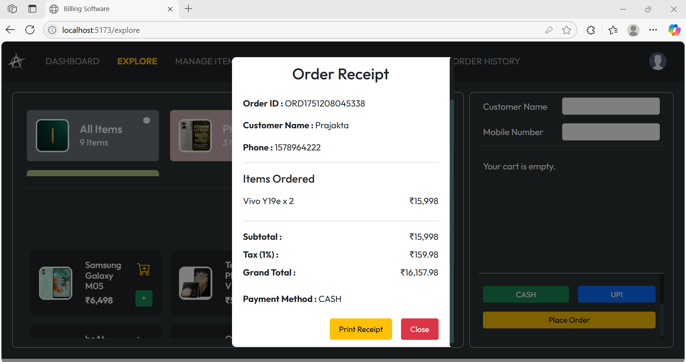

# Alpha E-Commerce Website 🛒

Alpha is a full-stack e-commerce web application that allows users to explore and shop items based on categories, while administrators can manage inventory, users, and orders. The project supports user and admin roles with secure authentication and real-time updates.

## 🔑 Features

### 👤 User Panel
- 🔍 **Explore Page**: View categorized items with images.
- 🛒 **Cart & Checkout**: Add items to the cart and place orders using Razorpay UPI or Cash.
- 📦 **Dashboard**: View recent order summary.
- 📑 **Order History**: Track all past orders.

### 🛠️ Admin Panel
- 📋 **Manage Items**: Add, update, or delete items from inventory.
- 🗂️ **Manage Categories**: Create and manage item categories.
- 👥 **Manage Users**: Register admin or user roles.
- 📦 **Order History**: View all customer orders.

## 🖼️ Image Storage
- Uses **Amazon S3 Bucket** to store and retrieve images for categories and items.

## 🔐 Authentication
- Login system with role-based access (User/Admin).
- JWT-based token management.

## 🧰 Tech Stack

| Frontend     | Backend        | Database     | Storage     | Others            |
|--------------|----------------|--------------|-------------|-------------------|
| React.js     | Spring Boot    | PostgreSQL   | Amazon S3   | Razorpay API      |
| Bootstrap    | RESTful APIs   | JPA/Hibernate|             | React Hot Toast   |
| CSS          |                |              |             | Use State Hook    | 
|              |                |              |             | Navigate Hook     |
|              |                |              |             | Use Effect Hook   |

## 🚀 Getting Started

1. Clone the repo
2. Configure backend properties (DB, AWS credentials, Razorpay keys)
3. Run backend using Spring Boot
4. Run frontend using `npm run dev`
5. Access at `http://localhost:5173`

## 📸 Website Preview

### 🔐 Sign-In Page

---

### 🏠 Home / Dashboard

#### 👤 Admin Dashboard

#### 👥 User Dashboard

---

### 🔍 Explore & Management Pages

#### 🧭 Explore Page

#### 📂 Category Management

#### 📦 Item Management

#### 👥 User Management

---

### 📑 Orders & Receipts

#### 📜 Order History

#### 🧾 Receipt

## 🔌 API Endpoints

Base URL: `https://your-deployment-url.com/api/v1.0`

### 🔐 Auth
- `POST /login` – Login with username and password
- `POST /admin/register` – Register a new user (Admin only)
- `GET /admin/users` – Get all the users (Admin only)
- `DELETE /admin/users/{id}` – Deletes user (Admin only)

### 🏠 Home / Dashboard
- `GET /dashboard` – Get all the latest orders

### 🛍️ Items
- `GET /items` – Get all items
- `POST /admin/items` – Add new item (Admin only)
- `DELETE /admin/items/{id}` – Delete item (Admin only)

### 📂️ Category
- `GET /categories` – Get all categories
- `POST /admin/categories` – Add new category (Admin only)
- `DELETE /admin/categories/{categoryId}` – Delete category (Admin only)

### 📦 Orders & Payments
- `POST /orders` – Place a new order
- `DELETE /orders/{orderId}` – Delete order
- `GET /orders/latest` – view all orders
- `POST /payments/create-order` – Creates a order
- `POST /payments/verify` – Verify the payment

## 📝 License
This project is for personal learning and demonstration purposes.
